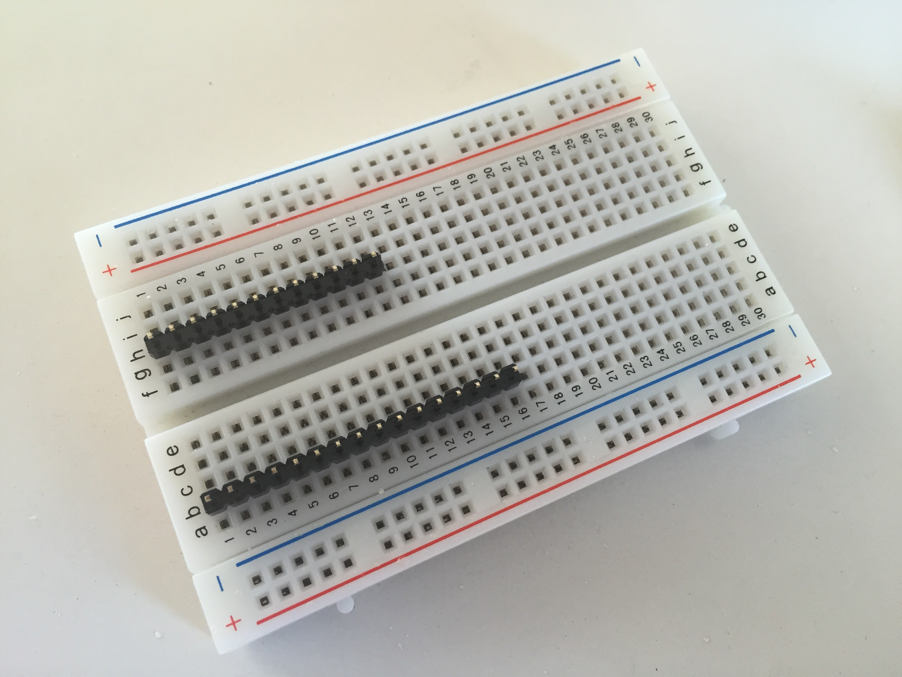

# Harlem Heat Sensors

Documenting the process.


## Sensor Assembly

### Ingredients

_Key Parts_

- [Adafruit Feather 32u4 Basic Proto Board](https://www.adafruit.com/product/2771)
- [Adalogger FeatherWing - RTC + SD Add-on](https://www.adafruit.com/products/2922) ]
- [DHT22 temperature-humidity sensor](https://www.adafruit.com/products/385)
- [Stacking Header Pins](https://www.adafruit.com/products/2830)
- [CR1220 Coin Cell Battery](https://www.adafruit.com/products/380)
- [Lithium Ion Battery](https://www.adafruit.com/products/2011)
- [SD Cards](https://www.adafruit.com/products/102)
- [USB Micro cable](https://www.adafruit.com/products/2185)

_Optional Part_

- [Breadboard](https://www.adafruit.com/products/64)

Need one of each of these. All of the parts (except the breadboard) are listed in this [Adafruit wishlist](http://www.adafruit.com/wishlists/406691) I made for easy buying. 

### Tools

- A soldering iron ([this one](https://www.adafruit.com/products/180) works, I use [this one](https://www.amazon.com/Weller-WES51-Analog-Soldering-Station/dp/B000BRC2XU))
- [Solder](https://www.adafruit.com/products/1930)
- Wire snippers ([this kind](https://www.sparkfun.com/products/11952) is great because it allows you to snip wires close to the board)
- Needle-nose pliers 

### Steps

Here's what I did to assemble these boards. Suggestions and improvements welcome!

#### Soldering Basic Proto Board

The first step is to solder the [Stacking Header Pins](https://www.adafruit.com/products/2830) onto the [Adafruit Feather 32u4 Basic Proto Board](https://www.adafruit.com/product/2771) (which I'll generally refer to as the "Proto Board").

The hardest part of soldering, I find, is holding the parts in place. That's where the [breadboard](https://www.adafruit.com/products/64) comes in. Here's how I did it. 

- Grab the headers (the rows of little pins) that the Proto Board comes with and put their long ends into columns _b_ and _h_ on the breadboard, with one pin from each set also in _Row 1_. (In the picture below, I've already snapped one of the lengths to a row of 12 pins, which you can do now or later.)



- Slide the [Stacking Header Pins](https://www.adafruit.com/products/2830) into the pins now sticking out of the breadboard. 

 corresponding holes on the Proto Board, with the plastic sides of the headers ending up on the "top" of the board (along with all of the other little parts) and the headers' pins sticking out the "bottom" of the board, which is smoother than the other side.

(image of putting header pins on breadboard)

- Holding the Stacking Header Pins in place, turn the entire assembly upside down onto the rows of short pins sticking out of the breadboard. The idea is that the pins in the breadboard provide a base for the upside-down Stacking Headers. You should now have the bottom of the Basic Proto board facing upward, along with the long pins of the Stacking Headers -- all ready to solder.
- Solder all of the pins to the board. 
- Remove the board from the breadboard setup.

#### Soldering the RTC/SD FeatherWing

The [Adalogger FeatherWing - RTC + SD Add-on](https://www.adafruit.com/products/2922) is the other board, which has a little round battery holder and a slot for an SD card on one side. That's the top side.

- Take the row of pins out of _Column a_ of the breadboard.
- This row of pins is designed to break apart. You want to snap off a row of 12 pins. (Since these rows usually come in lengths of 16 pins, it's easier to snap off 4 pins from one end.)
- Replace the shortened row of pins into _Column a_ of the breadboard, with one of the pins also in _Row 1_.
- Place the outer rows of holes of the RTC/SD FeatherWing (the holes closest to the edge of the board) onto the rows of pins on the breadboard. It should fit nicely!
- (A set of these pins also come with the RTC/SD board, so now you have spares.)
- Solder all the pins to the board.
- Remove the board from the breadboard.
- Snap the [CR1220 Coin Cell Battery](https://www.adafruit.com/products/380) into the round holder on the RTC board. I did this by tucking the battery under the tiny plastic tabs near the short side of the board and _then_ under the gold bar across the battery holder.
- Gently slide the mini-SD card, label-side up, into the slot on the board until it comfortably clicks into place.

#### Soldering the Temperature Sensor

These are the steps for adding the [DHT22 temperature-humidity sensor](https://www.adafruit.com/products/385) onto the base board. This is the trickiest part of the assembly process.  

- Insert the temperature sensor into the Base Proto board as shown:

(image)

- You may want to support the temperature sensor with a stack of three quarters to hold it horizontal while you solder.
- **Secure the Sensor** Looking at the bottom of the Base Proto board (and the back of the temperature sensor), and with the temperature sensor pointing away from you, solder the second pin from the left to the board. See image below for a visual. This pin is actually not used by the sensor, but we're soldering it first to hold it in place.

(iumage of soldering second pin)

- **Grounding the Sensor** With the same orientation, use the needle-nose pliers to bend the sensor's first pin on the left so it reaches and actually fits partly inside the first row of "ground" holes, and solder it to the hole as shown: 

(image of soldered to ground)

- **Insert the Resistor** Bend the legs of the resistor that came with the temperature sensor and, from the other side of the board, insert the legs so their long wires come through these two holes:

(image of holes, with resistor outline -- showing where it is on the other side of the board)

- **Power to the Sensor** Solder the topmost resistor leg to both the hole it came through and to the rightmost pin on the temperature sensor. I actually use the little hole between the resistor leg and the temperature sensor as a solder meeting point.

- **Data link to the Sensor** This is the trickiest one. We need to connect the remaining sensor pin (second from the right) to the remaining resistor leg _and_ to the Feather's header pin Number 5. It's the third one down on the right side. You can see a small "5" printed on the board itself. I do this by:
  - Using the needle-nose pliers to pend the Number 5 pin so it arcs over the first row of holes to the hole where the resistor leg is, and solder the two together there. (The Number 5 pin must not touch the row of holes nearest to it.)
  - Bending the remaining resistor leg to meet the sensor leg at a hole between them, and soldering them together there.
  
  (image)
  
#### Final Sensor Assembly

- Stack the RTC/SD Featherwing board on top of the Base Proto board, making sure all pins go into all holes.

- Using the wirecutters, clip all of the long pins off the bottom of the Base Proto board. Be sure not to accidentally cut the one pin that we used to connect to the temperature sensor in the previous section.
  
- Put a segment of double-sided tape onto the bottom of the Base Proto board.

- Adhere the large [Lithium Ion Battery](https://www.adafruit.com/products/2011) onto the double-sided tape.

- Firmly insert the plug from the [Lithium Ion Battery](https://www.adafruit.com/products/2011) into the matching outlet on the base board.

- If the Lithium Ion Batter is just out of its package, or is not fully charged for some reason, plugged a [USB Micro cable](https://www.adafruit.com/products/2185) into the USB outlet on the Base Proto board and also into any computer USB outlet or cell-phone battery charger. This will charge the battery (the sensor will continue to operate as well). A yellow light on the board glows while charging is underway. I let them charge overnight, and they were ready in the morning. 

- If the SD card did not come [from Adafruit](https://www.adafruit.com/products/102), you may need to format the card using the [SD Card Formatter](https://www.sdcard.org/downloads/formatter_4/) that Adafruit recommends. Do _not_ format the card with the disk formatting application that comes with your computer.

- To make sure nobody mistakes our sensor for something nefarious, I added this label to the bottom of each one, on the Lithium Ion Battery: 

```
HI! I am a Temperature Sensor!
Please keep me away from children and pets.
If I am lost or damaged, please call (646) 801-9698
or email wnyclabs@gmail.com.
```

## Software Installation

The software that comes pre-loaded on the Feather isn't what we need for this project. 

### IDE and Board Setup

- Arduino software from http://arduino.cc
- Need to add Adafruit Third Party board codes to the Arduino software. [See this setup page](https://learn.adafruit.com/add-boards-arduino-v164/setup).
- The URL for Adafruit's boards is kept [on this wiki page](https://github.com/arduino/Arduino/wiki/Unofficial-list-of-3rd-party-boards-support-urls#list-of-3rd-party-boards-support-urls).
- Only after you've done the above, can you use [Adafruit's Feather instructions](https://learn.adafruit.com/adafruit-feather-32u4-basic-proto?view=all), which are missing the above components. Oh, wait. It's there. But below, out of order.

### Additional Libraries

RTC libarary from Adafruit:
https://github.com/adafruit/RTClib

SD card libarary from Arduino:
https://www.arduino.cc/en/Reference/SD

Battery-monitoring code based on info from Adafruit at:
https://learn.adafruit.com/adafruit-feather-32u4-basic-proto/power-management

Library for the temperature humidity sensor:
get at https://github.com/RobTillaart/Arduino/tree/master/libraries/DHTlib

Library for low-power sleep move
get at http://jeelabs.net/projects/jeelib/wiki

Low-power sleep code from Jean-Claude Wippler
http://jeelabs.net/pub/docs/jeelib/classSleepy.html and
http://jeelabs.net/projects/jeelib/wiki
Which is well-described here: http://jeelabs.org/2011/12/13/developing-a-low-power-sketch/

### The Fickle Feather

Uploading code to the Feather is tricky. Adafruit has [some explanations about how to do it](https://learn.adafruit.com/adafruit-feather-32u4-basic-proto/using-with-arduino-ide), and how to navigate the problem of the communication port disappearing. But those didn't always work for me.

Here's what did:
- I prepared the code I wanted to upload in my Arduino software.
- Plugged a battery into the board.
- Plugged a USB micro cable into the board.
- Unplugged the USB cable from my Mac. 

Then, in quick succession, I did this:
- Pressed RESET on the Feather (the red LED begins to pulse)
- Plugged the USB into my Mac
- Hit the "Upload" button on my Arduino software.

Those last three steps all happen before the red LED stops pulsing. This seemed to be the most reliable way to get it working. 

### Getting Things Going

Using the method above, I load two sketches in sequence:

- First I loaded `HarlemHeat_TimeSetter.ino` onto the board. This runs the following code, which set the Real Time Clock (RTC) to the computer's time:

```
RTC.adjust(DateTime(F(__DATE__), F(__TIME__))); 
```

- Next I open the current version of the HarlemHeat sensor code, `HarlemHeat_vX.ino` and changed the Unit ID to match the code written on the sensor I have in hand:

```
String unit_id = "HH100";
```

- Then I upload `HarlemHeat_vX.ino` to the board.


## Calibration

I put all of the units into a wooden box with an opening on one side in the middle of our office. From 1:30 to 3 p.m. on 7/8/2016 they took readings together. Those readings should be used for the comparison between units.

The files for those units, including those readings, are in this repo in data/pre_deployment_test

In the process of importing these files, also double-checked that the device number matched the file name.


## SD Card Hack

One problem we faced in the early going was the requirement that after you took out and put back the SD card -- to get the data off it, for example -- the sensor would stop working. The original solution to that was to ask all participants to _press the reset button_ after putting an SD card back into the unit.

Many people did this, but some didn't. Or it didn't take. Unfortunately, the consequences of not resetting the unit was to stop collecting data. Which was bad.

After a lot of Googling, I found a glimmer of hope: A small addition to the Arduino SD card library. 

### Changing the Library

Here's what I did. I'm using the Arduino software on a Mac; the process is no doubt different (though similar) on a PC.

- I right-clicked on the Arduino application and chose "Show Package Content"
- I navigated to Contents > Resources > Java > libraries > SD > src 
- In the "src" folder I used a text editor to open the file `SD.cpp`
- I searched the file for "::begin"
- At that point in the code, I added these lines i found [here](https://github.com/arduino-libraries/SD/issues/5):

```arduino
boolean SDClass::begin(uint8_t csPin) {
  /*

    Performs the initialisation required by the sdfatlib library.

    Return true if initialization succeeds, false otherwise.

   */
	 
	// ----> Line Added
	if (root.isOpen()) root.close();      // allows repeated calls
	// <--- Line Added
	 
  return card.init(SPI_HALF_SPEED, csPin) &&
         volume.init(card) &&
         root.openRoot(volume);
}

// ---> Lines Added
void SDClass::end()
{
  root.close();
}
// <---- Lines Added

```

- In the same "src" folder, I used a text editor to open "SD.h"
- I searched for "boolean begin" and then added one line in place:

```arduino
boolean begin(uint8_t csPin = SD_CHIP_SELECT_PIN);

// ---> Line Added
void end(); 
// <--- Line Added

```

- I saved both files
- I restarted my Arduino software

I then rewrote the sensor's code to "begin" and "end" connections with the SD card, and also to skip the whole sensor-reading process if the "begin" part fails (meaning there's no SD card in place, or there's some other problem).

This appears to allow a "hot swap" of the SD card without a reset. This 
